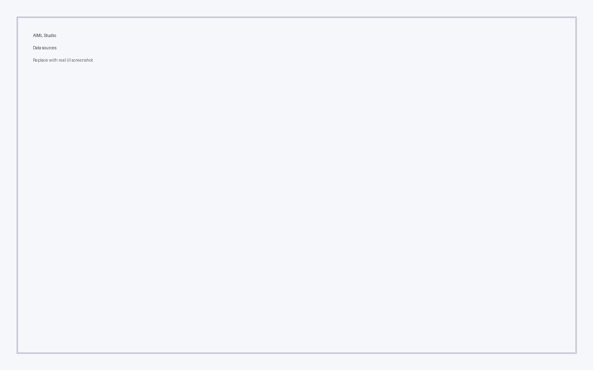
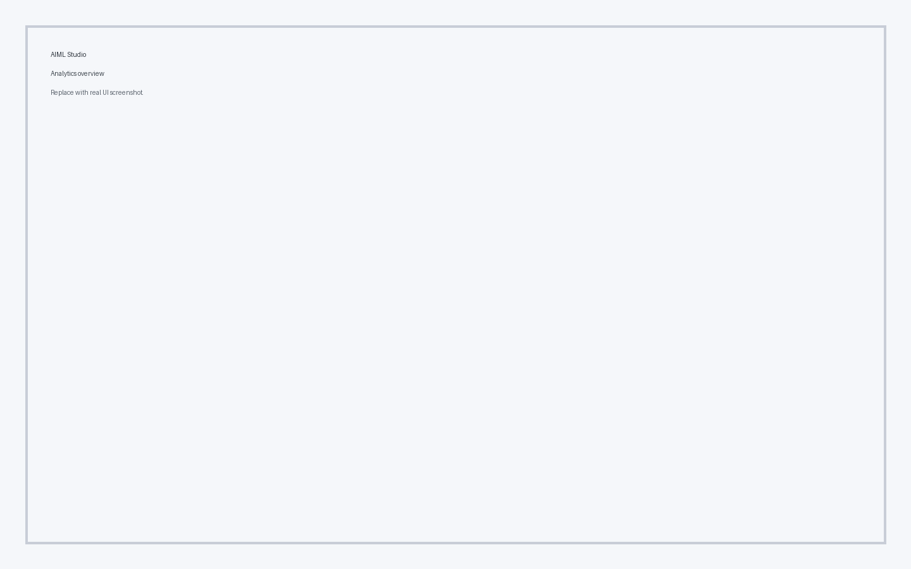

# Application Tour

Explore the main screens and user journeys in AIML Studio.

## Home dashboard

- KPI summaries and quick actions
- Recent projects and analytics snapshots
- Quick access to help resources

## Projects workspace

- Project status tracking
- Activity and ownership metadata
- Modal-driven project actions

## Data sources

- Source catalog with inline status
- Filterable list for quick access
- Clear empty-state messaging

## Analytics

- Table-driven metrics
- Trend indicators
- Export-ready views

## Settings

- Theme and layout preferences
- Session behavior toggles
- Personalized defaults

## Logs

- Structured log feed
- Quick filtering patterns
- Contextual severity cues

## Help center

- Guided support cards
- Documentation shortcuts
- FAQ entry points
