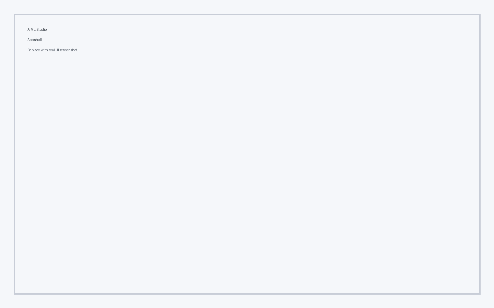

# Components

Core UI components used throughout AIML Studio.

## Application shell

The AppShell defines the global layout, including header, navbar, and footer regions.

## Navigation bar

- Primary navigation links
- Theme and RTL toggles
- Quick access utilities

## Header actions

- Page title and context
- Action buttons for page-level tasks

## KPI cards

Quick-glance metrics highlight top-level KPIs and progress signals.

## Tables

AG Grid tables are used for analytics, data sources, and logs.

## Modals & notifications

Modals, alerts, and notifications provide contextual feedback and confirmation flows.
