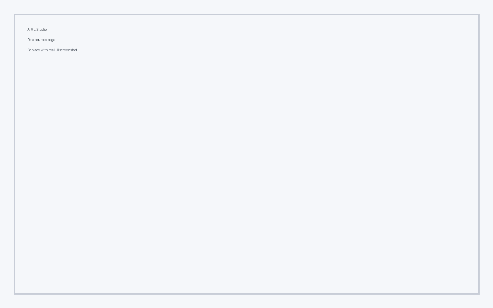
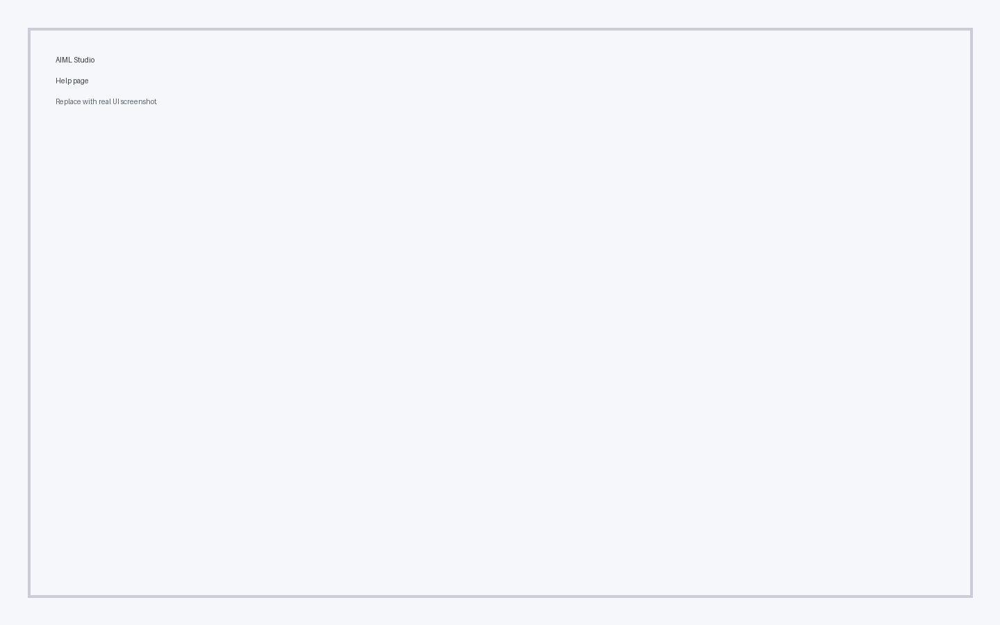

# Pages

Page-specific highlights and interaction patterns.

## Home

- Overview metrics
- Recent activity summaries
- Quick navigation links

## Projects

- Project status board
- Owner and timeline metadata
- Action-driven workflows

## Data Sources

- Source catalog
- Health indicators
- Filtering controls

## Analytics

- KPI tables
- Trend cards
- Data export actions

## Settings

- Theme preferences
- Layout toggles
- Defaults for table paging

## Logs

- Event feed table
- Severity badges
- Time-based filters

## Help

- Support resources
- Inline tooltips
- Documentation shortcuts
